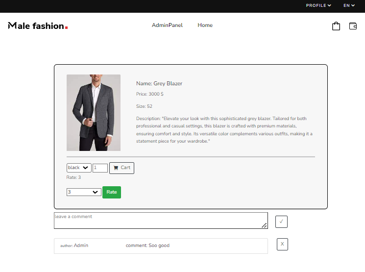
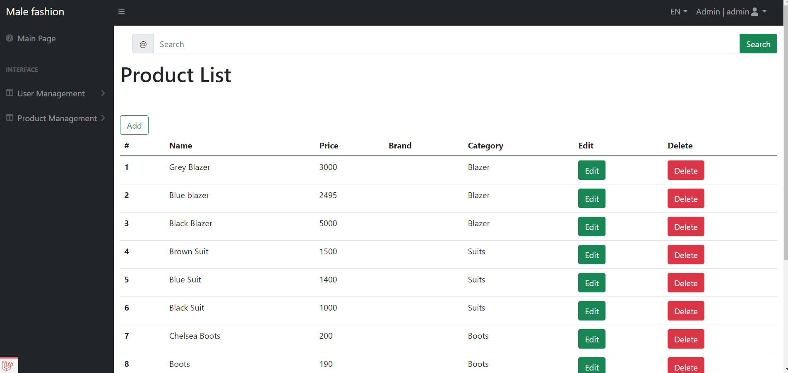
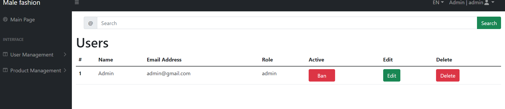

This is Shop Project made Laravel framework. 

Admin Panel admin:
    User management
    Edit/Delete/Add - Roles;
Admin Features
    Manage Users
    
    Create, read, update, delete (CRUD) operations on user accounts.
    Activate, deactivate, or suspend user accounts.
    View user details, roles, and permissions.
    Dashboard Overview
    
    Access to an overview dashboard displaying system statistics, user metrics, etc.
    View and manage site-wide settings and configurations.
    Content Management
    
    CRUD operations on various content types (articles, shops, products, etc.).
    Manage categories, tags, or classifications of content.
    User Permissions and Roles
    
    Create, update, delete user roles with specific permissions.
    Assign or modify permissions for different parts of the system.

Admin Panel admin/moderator/and other roles:

    Edit/Delete/Add - Category;
    Edit/Delete/Add - Product;
    Edit/Delete/Add - Manufacturer;

User can create/delete - comment, Cart, Wallet, Profile.

Images:

------------------------------ 
YouTube video - https://www.youtube.com/watch?v=R6SWKqfQMg8&t=1s
